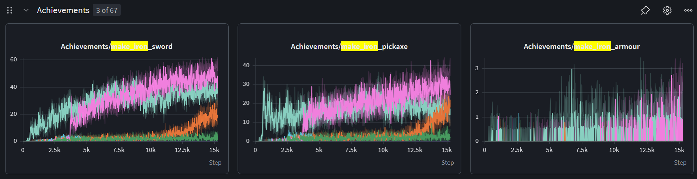
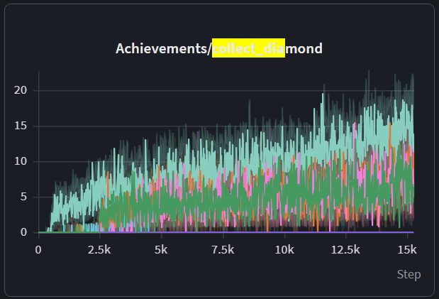
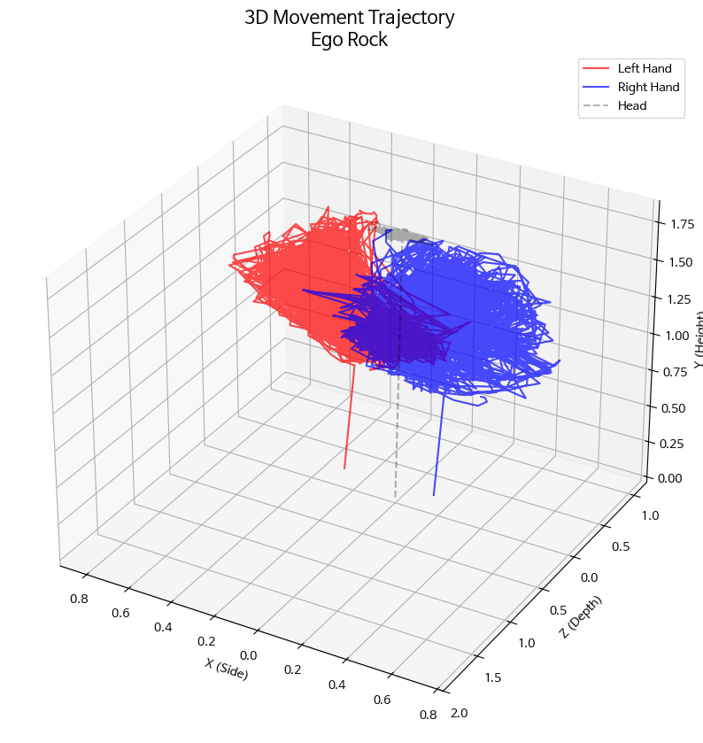
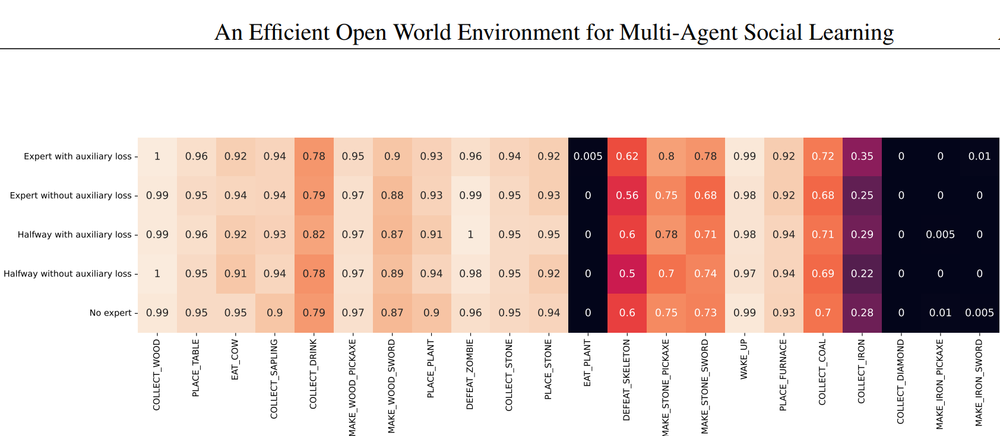

# MC-Planner Describe, Explain, Plan and Select Simulator

**Site (GitHub Pages):** [Project page](https://nullxeronier.github.io/Diffu_MoE_VLM/) · [Research note / blog](https://nullxeronier.github.io/Diffu_MoE_VLM/blog/building-diffu-moe-vlm.html) · [Code browser](https://nullxeronier.github.io/Diffu_MoE_VLM/code.html) · [Reproducibility report](https://nullxeronier.github.io/Diffu_MoE_VLM/reproducibility.html) · 한국어: [프로젝트](https://nullxeronier.github.io/Diffu_MoE_VLM/ko/) · [연구 노트](https://nullxeronier.github.io/Diffu_MoE_VLM/ko/blog/building-diffu-moe-vlm.html)

The site sources live in `docs/` (served from branch `portfolio/blog_init`, folder `/docs`). Opening `docs/*.html` on github.com shows the HTML source, not the page; use the links above. Rebuild the code snapshot with `python tools/build_code_snapshot.py`.

This project Simulates Open Ended Env
## Updated: Exceed consume metric(EAT_PLANT, MAKE...) in PPO Actor with IMU data 
this - with 3d trajectory time embedding

The achievement curves below come from **Craftax-Symbolic-v1** runs with 1B environment steps on a GPU
(x-axis: PPO updates of 1024 envs x 64 steps, so 15k updates = 1e9 steps); see
[Craftax in JAX](#craftax-in-jax-reproducing-the-reference-runs) to reproduce them.




trajectory



original paper: AN EFFICIENT OPEN WORLD ENVIRONMENT FOR MULTI-AGENT
SOCIAL LEARNING




## Project Structure

```text
.
├── diffu_moe_vlm/
│   ├── core.py               # Tech tree (recipes, tools), tasks, plan parsing, data loading
│   ├── env.py                # Symbolic Minecraft environment (Gymnasium API)
│   ├── planner.py            # LLM planner with rule-based fallback (Describe, Explain, Plan and Select)
│   ├── selector.py           # Sub-goal selection (plan_order, priority, dependency, horizon)
│   ├── controller.py         # Goal-conditioned controller producing macro actions
│   ├── evaluator.py          # Describe, Explain, Plan and Select evaluation loop and benchmark bookkeeping
│   ├── crafter_env.py        # Crafter (Gymnasium) wrapper, achievement success rates and score
│   ├── imu.py                # 3D trajectory / IMU data format and synthetic generator
│   ├── nn/                   # encoders (CNN/ViT/CLIP/SigLIP), MoE, time embedding, policy, diffusion
│   ├── rl/                   # PPO, diffusion BC, vectorized envs, rollouts, checkpoints
│   ├── benchmark_metrics.py  # MineDojo-style metrics
│   ├── wandb_integration.py  # Weights & Biases logging
│   ├── fp8_utils.py          # Optional FP8 / TensorRT-LLM support
│   └── data/                 # Goal library, task info, prompts
├── configs/                  # Hydra configuration
├── tests/                    # pytest suite
├── main.py                   # Planner (Describe, Explain, Plan and Select) evaluation entry point
├── train_ppo.py              # PPO + MoE training on Crafter
├── train_diffusion.py        # Diffusion policy behavior cloning on Crafter
├── evaluate_policy.py        # Policy evaluation (achievements, Crafter score)
├── run_icm_ablation.py       # ICM normalization experiment (GPU preset, CPU debug preset)
├── analyze_icm_ablation.py   # Report for the ICM experiment (bounded bonus? better exploration?)
└── pyproject.toml
```

## How the baseline works

1. **Environment** (`env.py`): a symbolic tech-tree world. Actions are macros such as
   `{'type': 'mine', 'item': 'wood'}` or `{'type': 'craft', 'item': 'stick'}`; they succeed only when
   the required tools and ingredients are in the inventory (e.g. cobblestone needs a wooden pickaxe,
   an iron ingot needs a furnace and coal). There is no 3D world yet: RGB/depth observations are blank
   frames kept for interface compatibility.
2. **Planner** (`planner.py`): asks an OpenAI-compatible LLM for a plan. If the LLM is disabled or
   unreachable, a rule-based planner derives the plan from the tech tree (quantity aware, e.g.
   `Mine cobblestone x6`). Plans are parsed into sub-goals such as `mine_wood`, `obtain_stick`.
3. **Selector** (`selector.py`): picks the next sub-goal among pending ones.
4. **Controller** (`controller.py`): turns the sub-goal into actions. With
   `controller.auto_prerequisites=true` it gathers missing tools/ingredients itself; with `false` it
   only attempts the sub-goal, so success depends on plan quality.
5. **Replanning** (`evaluator.py`): repeated action failures or a stuck sub-goal trigger a replan
   with the current inventory and the failure message.

Baseline (rule-based planner, default config): 6/6 default tasks succeed, e.g. `obtain_wooden_slab`
in 3 steps and `mine_diamond` in 34 steps.

## Installation

```bash
pip install -e .            # core (CPU only, no torch needed)
pip install -e ".[dev]"     # + pytest
pip install -e ".[ml]"      # + torch / transformers for model and FP8 code
pip install -e ".[rl]"      # + torch / crafter for learned policies
```

## Usage

```bash
# All default tasks
python main.py

# Single task
python main.py eval.single_task=true eval.task_name=obtain_stone_pickaxe

# Offline, without an LLM server or WandB
python main.py llm.enabled=false wandb.enabled=false

# Ablations
python main.py controller.auto_prerequisites=false   # plan quality must carry the task
python main.py env.action_failure_prob=0.3           # noisy low-level control, exercises replanning
python main.py goal_model.strategy=priority          # plan_order | priority | random | round_robin | dependency

# Tests
pytest
```

Results are written to `output_dir` (default `./outputs`): `results.json` or `result_<task>.json`.

## Learned policies on Crafter

[Crafter](https://github.com/danijar/crafter) gives 64x64 pixel observations, 17 actions and the
22 achievements used in the figures above (EAT_PLANT, MAKE_IRON_PICKAXE, COLLECT_DIAMOND, ...).

```
image (64x64x3) -> visual encoder ------------------+
                   cnn | vit | pretrained CLIP/SigLIP|
3D trajectory / IMU (B,T,J,3) + timestamps          +-> MoE trunk (top-k experts) -> policy / value heads (PPO)
                   -> TrajectoryEncoder (optional) -+

image -> encoder -> diffusion denoiser (FiLM) -> action chunk (H x 17 one-hot) -> receding-horizon execution
```

- **Encoders** (`nn/encoders.py`): small CNN and ViT trained from scratch; `pretrained` wraps a
  HuggingFace CLIP/SigLIP vision tower (frozen by default).
- **MoE** (`nn/moe.py`): top-k noisy gating with a Switch-style load-balancing loss
  (`ppo.moe_aux_coef`); expert load is logged per layer. `model.trunk=mlp` is the dense ablation.
- **PPO** (`rl/ppo.py`): clipped PPO with GAE; logs return, achievement success rates and the
  Crafter score (geometric mean of success rates).
- **Diffusion policy** (`nn/diffusion.py`, `rl/diffusion_bc.py`): DDPM over one-hot action chunks
  with clean-sample prediction, trained by behavior cloning on demonstrations from a PPO teacher;
  sampling supports full DDPM or strided DDIM steps.
- **3D trajectory / IMU** (`nn/time_embedding.py`, `imu.py`): multi-joint positions plus velocities
  with a continuous-time embedding of (irregular) timestamps and a transformer encoder. Data is
  `.npz` with `positions (N,T,J,3)`, `timestamps (N,T)`, optional `mask`/`labels`;
  `make_synthetic_trajectories` generates hand/head motions in this format. Set `model.trajectory`
  to condition the policy on it (Crafter itself has no IMU stream).

```bash
python train_ppo.py ppo.total_steps=1000000                       # runs/ppo/checkpoint.pt, eval.json
python train_ppo.py model.encoder.name=vit model.trunk=mlp        # ablations
python train_diffusion.py demos.policy_checkpoint=runs/ppo/checkpoint.pt
python evaluate_policy.py policy=runs/diffusion/checkpoint.pt episodes=50
python evaluate_policy.py policy=random                           # baseline
```

Smoke-scale results (4-core CPU, single seed, 20 evaluation episodes on the same worlds; far from
converged, Crafter runs usually use 1M+ steps):

| Policy | Training | Return | Crafter score |
|---|---|---|---|
| Random | - | 1.25 | 1.56 |
| PPO, CNN + MoE (4 experts, top-2) | 100k env steps | 3.60 | 4.63 |
| Diffusion BC (horizon 8, 10 DDIM steps) | 20k PPO demo steps, 3k updates | 3.55 | 3.56 |

Each run writes `metrics.jsonl`, `checkpoint.pt` (weights + model config, reloadable with
`diffu_moe_vlm.rl.checkpoint.load_policy`) and `eval.json`. Set `wandb.enabled=true` to log to W&B.

## Craftax in JAX (reproducing the reference runs)

The reference W&B runs use [Craftax](https://github.com/MichaelTMatthews/Craftax)-Symbolic-v1
(8268-dim symbolic observation, 43 actions, ~65 achievements across dungeon floors) trained for
1e9 steps at 50k-95k steps/s on one GPU. That speed comes from running the environment and PPO
together in JAX, so this path (`diffu_moe_vlm/jax_rl/`) is separate from the PyTorch/Crafter one:

- `wrappers.py`: vmapped Craftax with optimistic resets (only `num_envs / reset_ratio` new worlds
  are generated per step) and episode logging.
- `networks.py`: baseline feed-forward actor-critic (3x512 tanh), PPO-RNN (GRU), optional top-k MoE
  hidden layers, ICM.
- `ppo.py`: PPO / PPO-RNN with GAE, fully jitted; logs return, length, achievements per episode and
  every achievement's success rate. The ICM bonus is divided by its running mean and scaled by
  `icm_reward_coef` (0.01); the reference ICM run used an unscaled bonus and collapsed to ~0 reward.

```bash
pip install -e ".[jax]" && pip install -U "jax[cuda12]"        # GPU
python train_craftax.py                                         # PPO, 1e9 steps
python train_craftax.py algo.rnn=true                           # PPO-RNN
python train_craftax.py algo.moe=true                           # MoE hidden layers
python compare_craftax_run.py runs/craftax/metrics.jsonl --ref ppo      # vs. reference runs
```

Runs write `checkpoint.npz` (full state: params, optimizer, env states, RNG) every
`checkpoint_every` updates; re-running with the same `output_dir` resumes and gives bit-identical
results to an uninterrupted run. `max_updates_per_run=N` stops after N updates for time-limited jobs.

`docs/craftax_reference.json` holds end-of-training ranges read off the reference charts
(PPO: return ~26-28, ~21 achievements/episode; PPO-RNN: return ~37, ~24.5). Default
hyper-parameters follow the Craftax PPO baselines; confirm them against the reference runs' config.

### Experiment: does moving-mean normalization of the ICM bonus help?

`run_icm_ablation.py` trains the same Craftax PPO with one change per arm (`ppo` without curiosity,
and ICM with the bonus left raw, divided by the running std, the running mean or an EMA of the mean)
and `analyze_icm_ablation.py` answers two questions, paired by seed against `ppo`: does the
moving-mean bonus stay bounded while the others run away (bonus share of |reward|), and does it
explore more (achievement types reached, Craftax score) without lowering the extrinsic return?
See [`docs/icm_normalization_experiment.md`](docs/icm_normalization_experiment.md).

```bash
python run_icm_ablation.py                         # GPU: 5 arms x 3 seeds x 1e9 steps, then report.md
python run_icm_ablation.py --steps 2e8 --arms ppo icm_mean icm_std   # shorter screen
python run_icm_ablation.py --preset cpu-debug      # CPU: pipeline check only, tiny model
```

## Local LLM Setup

The planner talks to an OpenAI-compatible `/chat/completions` endpoint. Configure it in
`configs/defaults.yaml` (`llm:` section) or with environment variables, which take precedence:

```bash
export LLM_API_BASE="http://localhost:8000/v1"
export LLM_MODEL="local-llama3"
export LLM_API_KEY="DUMMY"
# Or copy .env.example to .env (never commit API keys)
```

## Data

`diffu_moe_vlm/data/` contains the goal library, goal mappings, task info and the prompt templates
used by the planner.

## Development

This project is designed for research in multi-task agents using large language models in Minecraft
environments. Open items: connecting the learned Crafter policies to the Describe, Explain, Plan and Select planner as low-level
skills, real IMU recordings in the trajectory format above, and longer GPU training runs.
